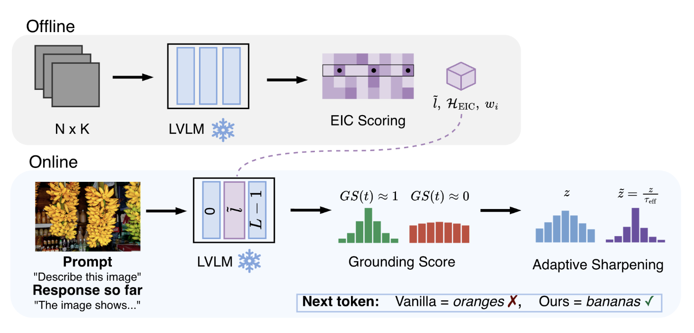
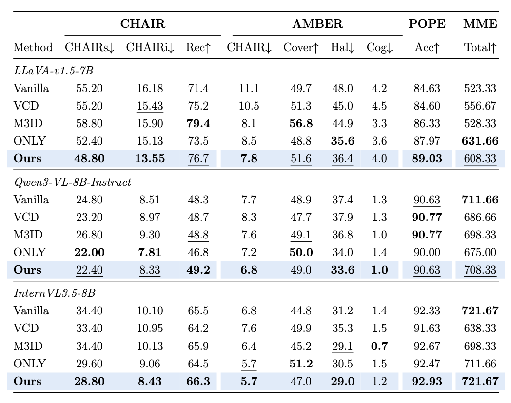
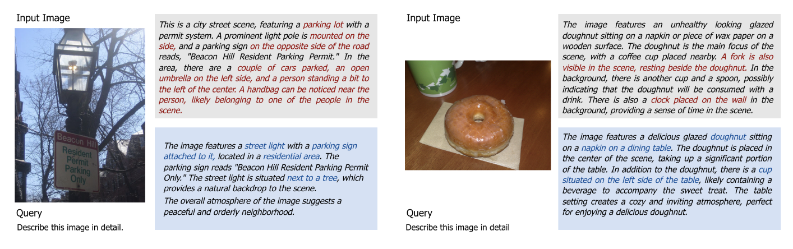

# Grounding-Guided Decoding

Anonymous implementation of Grounding-Guided Decoding (GGD), a training-free method that calibrates an environment-invariant grounding sensor offline and adaptively sharpens decoding when visual grounding weakens.



## Results

GGD reduces object hallucination across LLaVA-v1.5-7B, Qwen3-VL-8B-Instruct, and InternVL3.5-8B while preserving object recall and general multimodal capability.



<details>
<summary>Qualitative examples</summary>



</details>

## Installation

```bash
bash scripts/setup_env.sh
conda activate ggd
```

The release uses Python 3.10 and installs the dependencies in `requirements.txt`. Model and dataset locations can be overridden in `scripts/_env.sh`.

## Data preparation

The default directory layout is:

```text
data/
├── models/
│   ├── llava-v1.5-7b/
│   ├── Qwen3-VL-8B-Instruct/
│   └── InternVL3_5-8B-HF/
├── coco/
│   ├── annotations/
│   └── val2014/
├── POPE/
├── AMBER/
├── MME/
└── mmbench/
```

Datasets and model weights are not redistributed.

## Calibration

Calibrate EIC scores once for each model:

```bash
bash scripts/calibrate/llava.sh
bash scripts/calibrate/qwen3.sh
bash scripts/calibrate/internvl.sh
```

Checkpoints are written to `scores/`.

## Evaluation

Run one model and benchmark:

```bash
bash scripts/reproduce/run.sh <model> <benchmark>
```

Supported models are `llava`, `qwen3`, and `internvl`. Hallucination benchmarks are `chair`, `pope`, `amber`, and `mme`. Capability benchmarks `mmvp` and `mmbench` are available for LLaVA and Qwen3-VL.

For example:

```bash
bash scripts/reproduce/run.sh llava chair
METHODS="vanilla ggd ascd" bash scripts/reproduce/run.sh llava chair
```

Submit the complete SLURM evaluation grid with:

```bash
bash scripts/reproduce/submit_all.sh
```

ASCD evaluation is available for LLaVA. Outputs are written to `results/`.

## Analysis

```bash
python experiments/analysis/grounding_trend.py --help
python experiments/analysis/environment_validity.py --help
python experiments/analysis/calibration_stability.py --help
python experiments/analysis/bootstrap_ci.py --help
python experiments/analysis/efficiency_benchmark.py --help
```

These scripts reproduce the grounding–hallucination trend, environment validation, calibration stability, paired confidence intervals, and efficiency analyses.

## Acknowledgements

Third-party components and baseline implementations are documented in [NOTICE](NOTICE). This anonymous release is distributed under the [MIT License](LICENSE).
